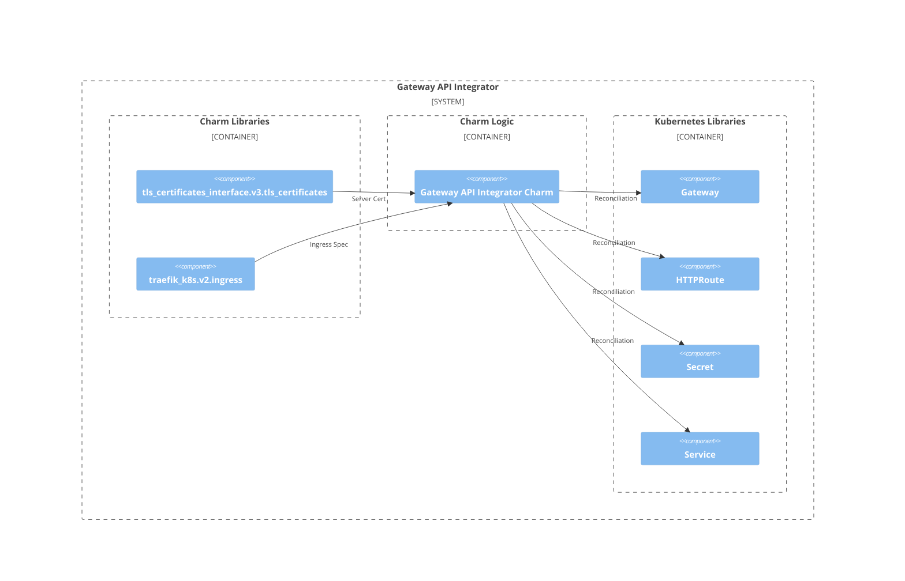

# Charm architecture

The `gateway-api-integrator` charm is very similar to the [`nginx-ingress-integrator`](https://charmhub.io/nginx-ingress-integrator)
charm in that it provides Kubernetes ingress to charms that require it. However,
instead of interacting with the Kubernetes cluster using the Ingress API, it 
uses the newer [Gateway API](https://kubernetes.io/docs/concepts/services-networking/gateway/)
, which offers a more portable, expressive, and extensible integration with all
types of Kubernetes clusters.

The Gateway API integrator receives ingress requests using the [`ingress` relation](https://github.com/canonical/charm-relation-interfaces/blob/main/interfaces/ingress/v2/README.md).  
It relies on the `tls-certificates` relation to gather TLS certificates for 
the gateway's TLS configuration. Information about the backend application is 
collected from the `ingress` relation and combined with the TLS certificates 
from the `tls-certificates` relation. As a result, Kubernetes [`Service` resources](https://kubernetes.io/docs/concepts/services-networking/service/),
[`Gateway` resources](https://gateway-api.sigs.k8s.io/concepts/api-overview/#gateway),
[`HTTPRoute` resources](https://gateway-api.sigs.k8s.io/concepts/api-overview/#httproute),
and [`Secret` resources](https://kubernetes.io/docs/concepts/configuration/secret/)
will be created to facilitate ingress as expected by the ingress requirer.

In designing this charm, we've leveraged the [sidecar](https://kubernetes.io/blog/2015/06/the-distributed-system-toolkit-patterns/#example-1-sidecar-containers) pattern for Kubernetes 
charms, but somewhat unusually we're not actually deploying a workload container
alongside our charm code. Instead, the charm code talks directly to the 
Kubernetes API to provision the appropriate Gateway API resource to enable 
traffic to reach the service in question. 

As a result, if you run `kubectl get pods` on a namespace named for the Juju 
model you’ve deployed the gateway-api-integrator charm into, you’ll see 
something like the following:

```
NAME                             READY   STATUS    RESTARTS   AGE
gateway-api-integrator-0       1/1     Running   0          3h47m
```

This shows there is only one container for the charm code.

## OCI images

Gateway Ingress Integrator charm doesn't use any OCI image resources.

## Juju events

For this charm, the following Juju events are observed:

1. [`config-changed`](https://canonical-juju.readthedocs-hosted.com/en/latest/user/reference/hook/#config-changed)
2. [`start`](https://canonical-juju.readthedocs-hosted.com/en/latest/user/reference/hook/#start)
3. [`data-provided` from `ingress` charm library](https://charmhub.io/traefik-k8s/libraries/ingress)
4. [`data-removed` from `ingress` charm library](https://charmhub.io/traefik-k8s/libraries/ingress)
5. [`certificate-available` from `tls_certificates` charm library](https://charmhub.io/tls-certificates-interface/libraries/tls_certificates)
6. [`certificate-expiring` from `tls_certificates` charm library](https://charmhub.io/tls-certificates-interface/libraries/tls_certificates)
7. [`certificate-invalidated` from `tls_certificates` charm library](https://charmhub.io/tls-certificates-interface/libraries/tls_certificates)
8. [`all-certificates-invalidated` from `tls_certificates` charm library](https://charmhub.io/tls-certificates-interface/libraries/tls_certificates)
9. [`get-certificate-action`](https://canonical-juju.readthedocs-hosted.com/en/latest/user/reference/hook/#action-action)
10. [`certificates-relation-created`](https://documentation.ubuntu.com/juju/latest/reference/hook/index.html#endpoint-relation-created)
11. [`certificates-relation-joined`](https://documentation.ubuntu.com/juju/latest/reference/hook/index.html#endpoint-relation-joined)
12. [`certificates-relation-broken`](https://documentation.ubuntu.com/juju/latest/reference/hook/index.html#endpoint-relation-broken)

## Charm code overview

The `src/charm.py` is the default entry point for a charm and has the 
`GatewayAPICharm` Python class which inherits from CharmBase. CharmBase is the 
base class from which all Charms are formed, defined by [Ops](https://juju.is/docs/sdk/ops)
(Python framework for developing charms).

> See more in the Juju docs: [Charm](https://documentation.ubuntu.com/juju/3.6/reference/charm/)

Take, for example, when a configuration is changed by using the CLI.

1. User runs the configuration command:
```bash
juju config gateway-api-integrator external-hostname=example.com
```
2. A `config-changed` event is emitted.
3. In the `__init__` method is defined how to handle this event like this:
```python
self.framework.observe(self.on.config_changed, self._on_config_changed)
```
4. The method `_on_config_changed`, for its turn, will take the necessary actions such as waiting for all the relations to be ready and then configuring the containers.

## Charm architecture diagram

The Gateway API Integrator charm uses the `ingress` and `tls_certificates` charm
libraries to handle charm relations. It also uses the `lightkube` Python 
Kubernetes client, which is wrapped in custom modules to reconcile the 
Kubernetes resources necessary for ingress.

